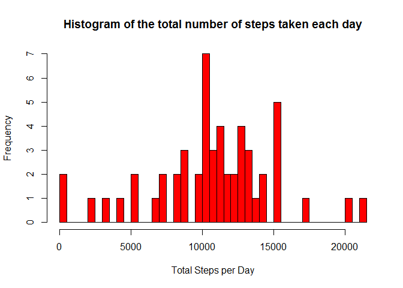
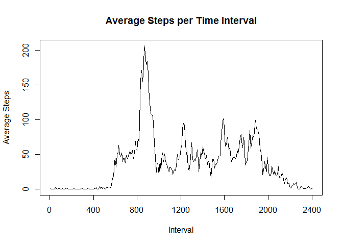
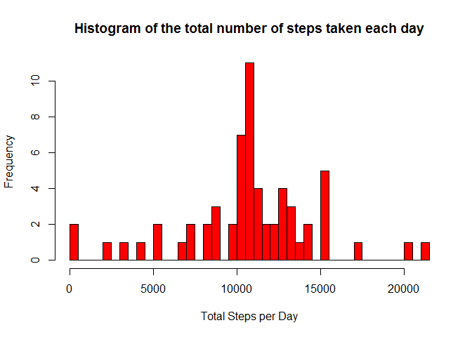

# Reproducible Research: Peer Assessment 1


## Loading and preprocessing the data


The specified data file is downloaded from the Internet.  As the file is in zipped format, it is unzipped and then read into a dataframe.


```r
# set Working directory for all files
setwd( "D:/Users/Michael/R Working Directory/Data Science Specialization" )

if( !file.exists( "activity.csv" ) ) {
 
    if( !file.exists( "repdata-data-activity.zip" ) ) {
     
        fileUrl <- "https://d396qusza40orc.cloudfront.net/repdata-data-activity.zip"
        download.file( fileUrl, destfile = "repdata-data-activity.zip" )
        dateDownloaded <- date()
     
    }
 
    unzip( "repdata-data-activity.zip" )
 
}

data <- read.csv( "activity.csv", header = TRUE, colClasses = c( "numeric", "character", "numeric" ) )
```


## What is mean total number of steps taken per day?


For this part of the assignment, any missing values in the dataset are ignored.  The *hist* function is used to make a histogram of the total number of steps taken each day.


```r
total_steps_per_day <- tapply( data$steps, data$date, sum )
hist( total_steps_per_day, breaks = 32, col = "red", xlab = "Total Steps per Day", main = "Histogram of the total number of steps taken each day" )
```

 


The mean and median total number of steps taken per day are calculated and reported.


```r
# set option for display of numeric results
options( scipen = 10 )

mean <- round( mean( total_steps_per_day, na.rm = TRUE ), 2 )
median <- median( total_steps_per_day, na.rm = TRUE )
```


The mean total number of steps taken per day is 10766.19.
The median total number of steps taken per day is 10765.


## What is the average daily activity pattern?


A time series plot is produced to show the average number of steps taken, averaged across all days, in each 5-minute time interval.


```r
average_steps_per_interval <- tapply( data$steps, data$interval, mean, na.rm = TRUE )
plot( average_steps_per_interval, type = "l", xaxt = "n", xlab = "Interval", ylab = "Average Steps", main = "Average Steps per Time Interval" )
axis( 1, at = seq( 0, 288, 48 ), seq( 0, 2400, 400 ) )
```

 


The 5-minute interval, on average across all the days in the dataset, containing the maximum number of steps is determined.


```r
max_interval <- data$interval[ which( average_steps_per_interval == max( average_steps_per_interval ) ) ]
max_average_steps <- round( max( average_steps_per_interval ), 2 )
```


The maximum average number of steps in any 5 minute time interval is 206.17 in time interval 835.


## Imputing missing values


The provided dataset contains a number of days/intervals where there are missing values (coded as NA). The presence of missing days may introduce bias into some calculations or summaries of the data.

The total number of missing values in the dataset (i.e. the total number of rows with NAs) is calculated by counting the number of rows where the is.na() function returns TRUE.


```r
missing_values <- sum( is.na( data$steps ) )
```


There are 2304 missing values (coded as NA) in the dataset.


A new dataset is created that is equal to the original dataset but with the missing values in the dataset replaced with the mean for the corresponding 5-minute interval.


```r
data_imputed <- data
data_imputed$steps[ is.na( data_imputed$steps ) ] <- average_steps_per_interval
```


With the missing values replaced with the mean for the corresponding 5-minute interval, the *hist* function is used to make a histogram of the total number of steps taken each day.


```r
total_steps_per_day_imputed <- tapply( data_imputed$steps, data_imputed$date, sum )
hist( total_steps_per_day_imputed, breaks = 32, col = "red", xlab = "Total Steps per Day", main = "Histogram of the total number of steps taken each day" )
```

 


The mean and median total number of steps taken per day are calculated and reported.


```r
mean_imputed <- round( mean( total_steps_per_day_imputed ), 2 )
median_imputed <- round( median( total_steps_per_day_imputed ), 2 )
```


The mean total number of steps taken per day is 10766.19.
The median total number of steps taken per day is 10766.19.


There are 8 days which were previously excluded from the analysis because of missing values.  Replacing the missing values with the mean for the corresponding 5-minute interval has added these 8 days to the histogram (in the 10500 to 11000 bin).  As each of these days now has a value for total number of steps taken per day equal to the mean from the previous analysis, the value of the mean is unchanged from the previous analysis, but the median has changed to be equal to the mean (because these 8 days lie in the "middle" of the distribution, one of these days is now the median).


## Are there differences in activity patterns between weekdays and weekends?


Using the dataset with the filled-in missing values, a new factor variable is created in the dataset with two levels - "weekday" and "weekend" indicating whether a given date is a weekday or weekend day.


```r
data_imputed$day_type <- rep( "weekday", length( data_imputed$date ) )
data_imputed$day_type[ weekdays( strptime( data_imputed$date, format = "%Y-%m-%d" ) ) %in% c( "Saturday", "Sunday" ) ] <- "weekend"
data_imputed$day_type <- factor( data_imputed$day_type )
```


A panel plot is produced containing a time series plot of the 5-minute interval and the average number of steps taken, averaged across all weekday days or weekend days.


```r
plot_data <- aggregate( steps ~ interval + day_type, data = data_imputed, FUN = "mean" )

if( "lattice" %in% rownames( installed.packages() ) == FALSE ) {
 
    install.packages( "lattice" )
 
}

library( lattice )

xyplot( steps ~ interval | day_type, plot_data, type = "l", layout = c( 1, 2 ), xlab = "Interval", ylab = "Number of Steps" )
```

 

The panel plot shows the differences in activity patterns between weekdays and weekends.


